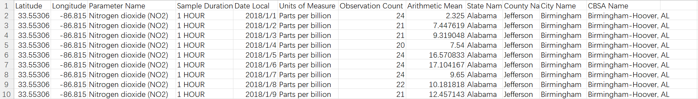

# Air Pollution 
- **Air_Pollution/daily_{pollutant}_{year}.csv**
  - Include the daily air pollution information measured by monitors across the United States between 2018 to 2021. It is collected from the Environmental Protection Agency of the United States.
  - Each row corresponds to the air pollution information at a certain (latitude, longitude) pair on a certain day.
  - The columns record [Latitude, Longitude, Parameter Name, Sample Duration, Date Local, Units of Measure, Observation Count, Arithmetic Mean, State Name, County Name, City Name, CBSA Name], respectively.
  - Observation Count represents the number of observations (samples) taken during the day, and Arithmetic Mean is the average (arithmetic mean) value for the day. 
  - State/County/City/CBSA Name(s) are the name(s) of the state/county/city/core bases statistical area (metropolitan area) where the monitoring site is located.
  - **Data Preview:**
  

