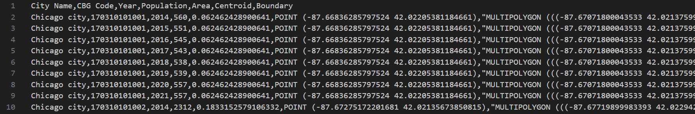
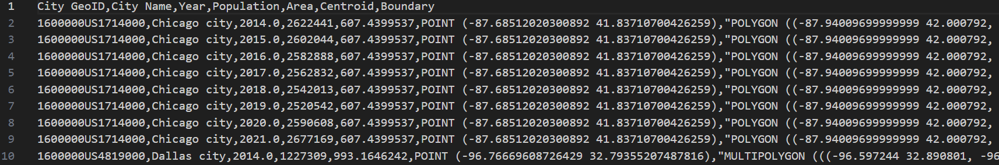
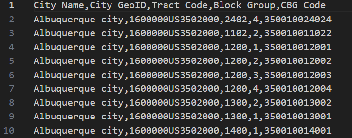

# Basic Geographic Info 
- **This folder contains three files:**
  - Basic_Geographic_Statistics_CBG.csv
  - Basic_Geographic_Statistics_City.csv
  - Geographic_Lookup_Table_Between_City_CBG.csv

- **Basic_Geographic_Statistics_CBG.csv** 
  - Contains the information of each CBG used in this dataset, such as City Name (which city they belong to), CBG Code, Year, Population, Area, Geographic Centroid, Geographical Boundary.

  **Data Preview:** 
  
  

- **Basic_Geographic_Statistics_City.csv** 
  - Contains the information of each city used in this dataset, such as City Name, City GeoID, Year, Population, Area, Geographic Centroid, Geographical Boundary.
  

  **Data Preview:**
  
  

- **Geographic_Lookup_Table_Between_City_CBG.csv** 
  - Contains the spatial correspondance between the city and CBG. The CBG is annotated by the CBG code and the city shows City Name and City GeoID.
  

  **Data Preview:** 
  
  
  
