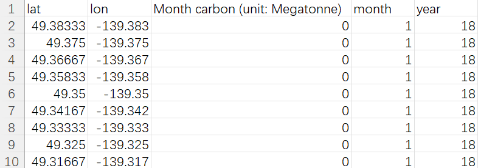

# Carbon 
- **Carbon/odiac_carbon_mainland_us.csv**
  - Record the 1kmx1km monthly CO2 emission statistics from the ODIAC database (https://odiac.org/data-product.html) in a CSV file. ODIAC is an open-data inventory that pioneered the combined use of nighttime lights data and point source data to achieve its global 1x1km resolution emission field.
  - You can use following codes to load the data:
```
import pandas as pd
odiac_values=pd.read_csv('odiac_carbon_mainland_us.csv')
```
where each row contains the location information (latitude, longitude), the temporal information (year, month) of the point, and the monthly carbon emission values in units of Megatonne.

  **Data Preview:**  

