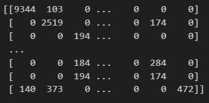
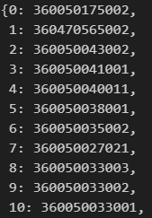

# Mobility 
- **Mobility/cbg_visit_{month}_{city_id}.npy**
  - Include the monthly frequency matrix of CBG-to-CBG population movements within each city from January 2018 to March 2022.
  - Within an NPY file, both the rows and columns represent a Census Block Group (CBG, a geographical region in the city), which is a square matrix with the number of people moving from the row CBG to the column CBG. 
  - city_id mapping: 1 New York, NY 2 Los Angeles, CA 3 Chicago, IL 4 Houston, TX 5 Phoenix, AZ 6 Philadelphia, PA 7 San Antonio, TX 8 San Diego, CA 9 Dallas, TX 10 San Jose, CA
  - The CBG ID represented by each column or row can be found in ID dicts.
  - You can use following codes to load a frequency matrix:​
```
import numpy as np
cbg_visit_matrix = np.load('cbg_visit_2018-01_1.npy')
``` 
​
  **Data Preview:**  
  


- **Mobility/id_dict_{city_id}.pkl**
  - Contains a dict mapping the row and column number in the previous matrices to the corresponding CBG ID. 
  - The CBG ID can be associated with the population attributes of each region in the Census dataset. 
  - You can use following codes to load an ID dict:
```
import pickle
with open('id_dict_1.pkl', 'rb') as f:
    id_dict = pickle.load(f)
``` 

 **Data Preview:**  
  
