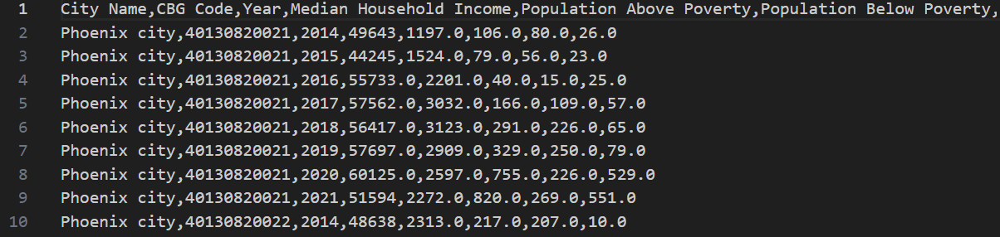
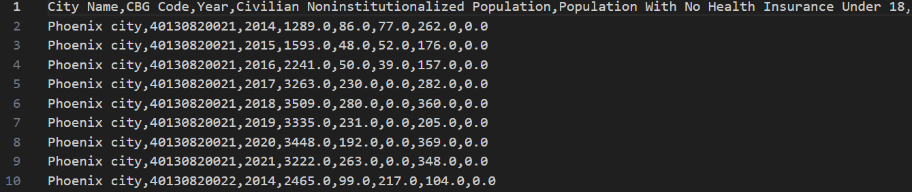
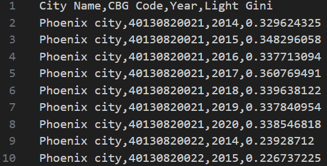

# Population 
- **This folder contains ten files:**
  - 01_Poverty_CBG_level.csv	
  - 01_Poverty_city_level.csv	
  - 03_Health_Insurance_CBG_level.csv	
  - 03_Health_Insurance_city_level.csv	
  - 04_Education_CBG_level.csv	
  - 04_Education_city_level.csv	
  - 10_Gini_CBG_level.csv	
  - 10_Gini_city_level.csv	
  - 11_Built_Environment_CBG_level.csv	
  - 11_Built_Environment_city_level.csv

- **01_Poverty_CBG_level.csv (01_Poverty_City_level.csv)** 
  - Contains the median household income, population above/below poverty, population with a ratio of income to poverty level under 0.5, and population with a ratio of income to poverty level between 0.5 to 0.99 at the CBG/city level. 

​
  **Data Preview:** 
  
  

- **03_ Health_Insurance_CBG_level.csv (03_ Health_Insurance_City_level.csv)** 
  - Contains civilian noninstitutionalized population, population with no health insurance under 18, population with no health insurance between 18 to 34, population with no health insurance between 35 to 64, and population with no health insurance over 65 years old at the CBG/city level.

  **Data Preview:**
  
  

- **04_Education_CBG_level.csv (04_Education_City_level.csv)** 
  - Contains population enrolled in college, population that graduated from high school, population with a bachelor’s degree, a master’s degree, and a doctorate at the CBG/city level.

​
  **Data Preview:** 
  
  

- **10_Gini_CBG_level.csv (10_Gini_City_level.csv)** 
  - Contains income Gini and light Gini at the CBG/city level.

  **Data Preview:**
  
  

- **11_Built_Environment_CBG_level.csv (11_Built_Environment_City_level.csv)** 
  - Contains building density, driving/cycling/walking road density, POI density, land use information (commercial, industrial, construction, and residential), and residential segregation (index of dissimilarity and entropy index) at the CBG/city level.

​
  **Data Preview:** 
  
  
